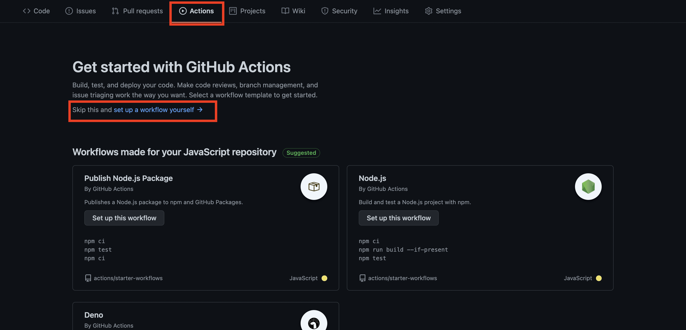

# 搭配Github actions建立一套 CI/CD系統

> 這只是一個幼幼班等級的淺談

## 前言

在學習所謂的CI/CD 的知識前，你可能應該要知道這整個流程在幹嘛。

以及你在這整個流程中扮演什麼角色。

[developer-roadmap](https://github.com/kamranahmedse/developer-roadmap)

在這邊有用到的技能。

* docker

* unit test 撰寫

* web server 的知識

* server os 的使用

* 雲端服務（GCP, Azure, AWS...）的使用

* 看文件的耐心！


## CI(Continuous integration)

* 持續整合

搭配git flow，開發人員在每一次的 Commit 後，能夠確保每次進入server的程式碼不會因為套件版本差異而產生錯誤。

可以測試這些交付上去的code，確認交付的程式碼都是通過測試的程式碼。


## CD(Continuous Deployment)

* 持續佈署

透過自動化方式，將寫好的程式碼更新到機器上並公開對外服務，另外需要確保套件版本＆資料庫資料正確性。


流程大概如下圖：


取至網路

## 建立測試

  * lint test

  * unit test

  ....

## 建立部署流程

  * 先熟知你要部署的流程

  * 來點Docker吧

## 搭建部署環境

> 我們用GCP 當作操作範例。

### GCE VM使用

* 創建一個VM 的 key [文件](https://cloud.google.com/compute/docs/instances/adding-removing-ssh-keys#createsshkeys)

```bash

$ ssh-keygen -t rsa -f ~/.ssh/[KEY_FILENAME] -C [USERNAME]

```

* 測試進入

```bash

$ ssh -i ~/.ssh/KEY_FILENAME USERNAME@IP

```

* 加密 Key

```bash
$ gpg --symmetric --cipher-algo AES256 ~/.ssh/KEY_FILENAME
```

* 移動至專案底下

```bash
$ mv ~/.ssh/KEY_FILENAME.gpg ./KEY_FILENAME.gpg
```

* 安裝 Docker 和 Docker-compose

```bash

$ sudo apt-get update

```

```bash
$ sudo apt-get install docker.io

```

```bash
$ sudo curl -L https://github.com/docker/compose/releases/download/1.18.0/docker-compose-`uname -s`-`uname -m` -o /usr/local/bin/docker-compose
```

```bash
$ chmod +x /usr/local/bin/docker-compose
```

* 測試一下是否安裝成功

```bash
$ sudo docker -v && sudo docker-compose -v
```


### GCR 使用

Build 一個image上去

```bash
$ docker build -t gcr.io/[your_gcp_project_id]/[your_image_name]:[tag_name] $PWD
```

推上 GCR:

```bash
$ gcloud docker -- push DOCKER_IMAGE_NAME:TAG
```

or

```bash
$ gcloud auth print-access-token | docker login -u oauth2accesstoken --password-stdin https://gcr.io
```

```bash
$ docker push cr.io/[your_gcp_project_id]/[your_image_name]:[tag_name]
```

## 設定你的第一個github actions workflows




## 使用你的github actions
  
* 設定Secrets 變數

* gcloud login

```bash

$ gcloud auth print-access-token

```

* 設定 SA-key

```bash
$ gcloud iam service-accounts keys create helloworld-key.json \
    --iam-account=ycsung-r@elk-tree-studio.iam.gserviceaccount.com
``` 

* 設定解密密碼


## 測試


```yml
test:
    # The type of runner that the job will run on
    runs-on: ubuntu-latest

    steps:
      # Checks-out your repository under $GITHUB_WORKSPACE, so your job can access it
      - uses: actions/checkout@v2

      - name: Install 🔧💚
        run: npm install

      - name: Lint 🧐
        run: npm run lint

      - name: Unit Test 🧐
        run: npm run test

```

## 部署

```yml

- name: Chmod Key 🚚 🚚 
  run: chmod 700 $HOME/secrets/key

- name: deploy in GCE
  run: | 
    ssh -o StrictHostKeyChecking=no -i $HOME/secrets/key ycsung_r@35.239.9.180 "./deploy.sh"

```

## 自動化

